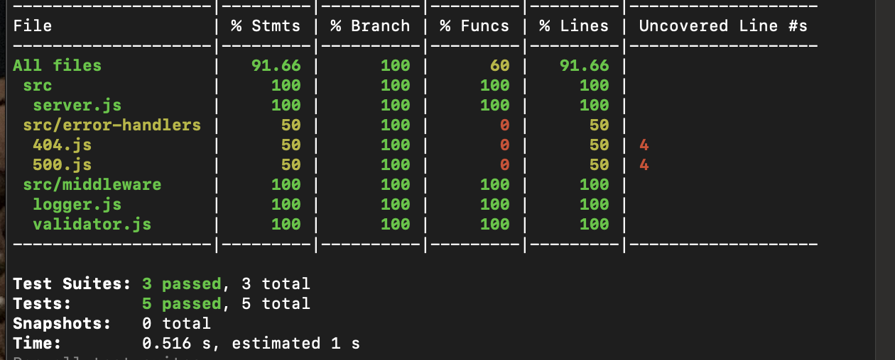

# [Heroku Link](https://dftjr-basic-express-server.herokuapp.com/)


# UML


# Install and Test Instructions

Step 1: Git clone [Repo Link](https://github.com/dftjr/basic-express-server.git)

Step 2: Install the nodes <code>npm i</code>

Step 3: Run the tests <code>npm test</code>

Step 4: Check to see that the code is passing, should look the the following picture below:



Step 5: Set-up your .env PORT path to whatever you prefer

Step 6: Start the server <code>nodemon</code>


# Notes: Class 02 - Express Framework

## Warm Up

```javascript

function map (values, callback) {

  if (Array.isArray(values)) {
    let newArray = [];
    for (let i= 0; i < values.length; i++) {
      newArray[i] = callback(values[i], i);
    }
    return newArray;
  } else {
    let newObj = {}
    let keys = Object.keys(values); // ["hot", "sunny"]
    for (let i= 0; i < keys.length; i++) {
      newObj[keys[i]] = callback(keys[i], values[keys[i]]);
    }
    return newObj;
  }
}

```

## Review

Troubles with deployment!

* Build successfully but application is getting errors.
* Using entry points, running code that is exported.
* We don't test entry points, instead we use them in different environments.
* Not a fan of of invision.

## Express

HTTP REST Framework.

### Routing

Express will capture a request, and towards some "function" that is defined on the "app" singleton.

### Middleware

Express defines middleware, as any function that comes between the request and the response.

We can pass a request object to the next middleware by calling the `next` function.

```javascript

app.get('/add', (request, response, next) => {
  console.log('middleware hit');
  next();
}, (request, response) => {
  response.send('You made it');
});

```

### Error Handling

by default express has a backed in 404 and 500 error.
* 404 are routes / resources not found.
* 500 are server errors.

Pass an argument into the `next` function.

define your own error handlers, define an error parameter, in a middleware function.

```javascript

app.get('/add', (request, response) => {
  if (!request.header.authorization) {
    next('unauthorized');
  }
  response.send('All good');
});

app.use(errorHandler);

function errorHandler(error, request, response, next) {
  console.log(error);
  response.status(401);
  response.send(error);
}


```

# Express

Express Server Mechanics: Routing, Middleware, and Approaches to Testing

## Learning Objectives

### Students will be able to

#### Describe and Define

- Node Modules
- Code Modularization
- Express Middleware
- HTTP Status Codes
- TDD and Testing

#### Execute

- Write an express API server
- Incorporate application level middleware
- Properly test an `express` server

## Today's Outline

<!-- To Be Completed By Instructor -->

## Notes

### Express Routing

- Event driven system
  - `app.get('/thing', (req,res) => {})`
  - This is the same pattern we see in Vanilla JS, jQuery
  - 'When a get event happens in our server, on "/thing", run this function...'
- The Request Object
  - `(req,..)`
  - /:parameters
    - `app.get('/api/:thing',...)` = `req.params.thing`
  - Query Strings
    - `http://server/route?ball=round` = `req.query.ball`
- The Response Object
  - `(..., res)`
  - Responsible for sending data back to the browser
  - Has methods like `send()` and `status()` that Express uses to format the output to the browser properly
    - Sends Headers
      - Cookies
      - Status Codes

### Express Middleware

- What does it do?
  - A series of functions that the request "goes through"
  - Each function receives `request`, `response` and `next` as parameters
  - Application Middleware run on every route/request
    - Error Handling, Logging, BODY Parsing
  - Route Middleware runs on specific routes
    - Are you logged in?

Middleware runs your code, and then runs the `next()` middleware in the series.

```javascript
function myLogger(req,res,next) {
  console.log(req.method);
  next(); // runs the next middleware in line
}
```

If you call `next()` with an argument, it'll skip all remaining middleware and run your error handler, with that argument as the error

```javascript
function loggedIn(req,res,next) {
  if( validUser ) { next(); } // Run the next middleware
  else { next("you need to login"); } // Run the error handler, skipping all other middleware
}
```

> Your route handler (your normal `(req,res)` function) is always the last middleware in the series!

### Server Testing

- Generally, avoid starting the actual server for testing
- Instead, export your server as a module in a library
- Then, you can a "mocking library" such as `supertest` to run your tests
  - This will hit your routes as though your server was running, without actually starting it

server.js

```javascript
const express = require('express');
const app = express();
app.get('/data', (req,res) => res.json({}));
// Export an object with the "app" in it.
module.exports = {
  start: () => app.listen(3000),
  server: app
}
```

server.test.js

```javascript
const supertest = require('supertest');
const myServer = require('server.js');
const client = supertest(myServer.server);
describe('my server', () => {
  test('can send data', () => {
    return client.get('/data')
      .then( response => {
        expect(response.body).toBeDefined();
      })
  })
})
```

### Setup for Testing

1. Install "Jest" so that you can run your tests
   `npm install jest`
1. Add the proper "testing scripts" to your `package.json` file

   ```json
   "scripts": {
     "test": "jest --coverage",
     "watch": "jest --coverage --watchAll"
   }
   ```

1. Run your tests on demand
   - `npm test`
1. Run your tests automatically as you save your files1
   - `npm run watch`
